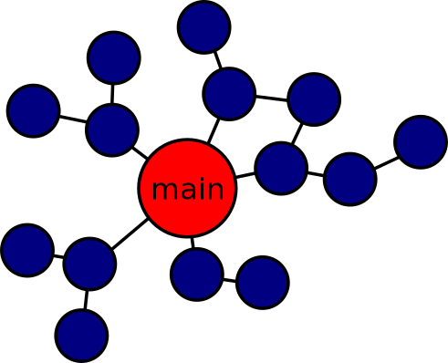

name: inverse
layout: true
class: center, middle, inverse

---

# Managing complexity and modular code development

## [Radovan Bast](http://bast.fr)

### [UiT The Arctic University of Norway](https://uit.no)

Licensed under [CC BY 4.0](https://creativecommons.org/licenses/by/4.0/).
Code examples: [OSI](http://opensource.org)-approved [MIT license](http://opensource.org/licenses/mit-license.html).

Credits: [Jonas Juselius](https://github.com/juselius),
         [Roberto Di Remigio](http://totaltrash.xyz),
         [Ole Martin Bjørndalen](https://github.com/olemb)

---

layout: false

## Complexity


---

## Complexity


(c) Joe Paradiso

---

## Complexity

- The back side: global variables


(c) Joe Paradiso

---


---

## [The tar pit](http://shaffner.us/cs/papers/tarpit.pdf)

- Over time software tends to become harder and harder to reason about
- The code base easily becomes untidy ("I'll fix it later")
- Small changes become harder to implement
- Hacks and workarounds trump design
- Bugs start appearing where in unexpected places
- More time is spent debugging than developing
- Complexity strangles development

(Slide taken from [Complexity in software development by Jonas Juselius](https://github.com/scisoft/complexity))

---

## Modular design is good

### Examples

- Lego
- Car manufacturing
- Design of your phone or laptop
- Modular composition when you order a laptop
- Success of USB
- Study programs

### Advantages

- Separation of concerns
- Composability
- Leveraging functionality

---

## Coupling and cohesion

- Strong coupling


- Loose coupling
    - Easier to reassemble
    - Easier to understand


---

## Coupling and cohesion

- Low cohesion: difficult to maintain, test, reuse, or even understand
    - Non-cohesive code has unnecessary dependencies
    - Swiss army knife modules


- High cohesion: associated with robustness, reliability, reusability, and understandability
    - Do one thing only and do it well
    - API of cohesive code changes less over time
    - Power of the Unix command line is a set of highly cohesive tools
    - Microservices


---

## Coupling and cohesion

- Minimize dependencies
- Prefer loose coupling and high cohesion


---

## Must haves 1/2

### Encapsulation

- Hide internals by language or by convention (header file in C/C++,
  public/private in Fortran, underscores in Python)
- "Python has no locked doors; it's a consenting adults language.
  If you open the door you're responsible for what you see." [R. Hettinger]
- Interface exposed in a separate file
- Expose the "what", hide the "how"

### Documentation

- Separate the "what it can do" from "how is it implemented"
- Documented API
- Versioned API ([semantic](http://semver.org) or [sentimental](http://sentimentalversioning.org)
  or [romantic](https://github.com/jashkenas/backbone/issues/2888#issuecomment-29076249) versioning)

---

## Must haves 2/2

### Testable on its own

- Sharpens interfaces
- Once you start testing your library you really see the coupling and cohesion

### Built on its own

- Prerequisite for testable on its own

### Own development history

- Decouple the development history
- Each unit should have its own Git history/repository

---

## Pure vs. stateful

Pure function

```python
# function which computes the body mass index
def get_bmi(mass_kg, height_m):
    return mass_kg/(height_m**2)

# compute the body mass index
bmi = get_bmi(mass_kg=90.0, height_m=1.91))
```

Stateful code

```python
mass_kg = 90.0
height_m = 1.91
bmi = 0.0

# function which computes the body mass index
def get_bmi():
    global bmi
    bmi = mass_kg/(height_m**2)

# compute the body mass index
get_bmi()
```
- Avoid global variables, including module and object state
- Do not reuse variables

---

## Purity

- Pure functions has no notion of state: They take input values and return
  values
- Given the same input, a pure function *always* returns the same value!
  Function calls can be optimized away!
- Pure function == data!
- Purity is key to equational reasoning


(Slide taken from [Complexity in software development by Jonas Juselius](https://github.com/scisoft/complexity))

---

## Enemy of the state

.left-column[

]
.right-column[
### Strive for pure functions, fear the state

- Pure functions do not have side effects
- Side effects lead to bugs and increase complexity
- Pure functions are easy to
    - Test
    - Understand
    - Reuse
    - Parallelize
    - Simplify
    - Refactor
    - Optimize

### But we need to deal with state somewhere
]

---

## Concurrency

- Concurrency in imperative code is very hard
- You are totally lost in the dark without a good thread checker
- In a pure, immutable world concurrency is nearly trivial!


(Slide taken from [Complexity in software development by Jonas Juselius](https://github.com/scisoft/complexity))

---

## Composition

- Composition enables us to build complex behavior from simple components
- We can reason about the components, and we can reason about the composite
- Composition is key to managing complexity
- Modularity does not imply simplicity, but is enabled by it


(Slide taken from [Complexity in software development by Jonas Juselius](https://github.com/scisoft/complexity))

---

## Object-oriented programming is often stateful programming

*"The problem with object-oriented languages is they've got all this implicit
environment that they carry around with them. You wanted a banana but what you
got was a gorilla holding the banana and the entire jungle."*

Joe Armstrong

- Do not write objects when a function will do

---

## One way to look at your code



- The main function calls other functions

---

## Where to deal with the state? Typical questions:

- Where to do file I/O?
    - In the main function?
    - Should we pass the file name and open the files deep down in functions?
    - Should we open the file and pass the file handle?
    - Should we read the data and pass the data?
- Where to keep "global" data?
    - In the main function?
    - In a Fortran common block?
    - In a Fortran module?
    - In functions with save attributes?

---

## Another way to look at your code


- The main function ("program" in Fortran) is on the outside shell

---

## Recommendations

- Keep I/O on the outside and connected
- Always read/write on the outside and pass data
- Do not read/write deep down inside the code
- Keep the inside of your code pure/stateless
- Move all the state "up" to the caller
- Keep the stateful outside shell thin
- Unit test the inside
- Regression test the shell


---

template: inverse

## Language specific recommendations

### (personal opinion)

---

## Divide and conquer

- Split the code up
- Construct your program from parts:
  - functions
  - modules
  - packages (Python) or libraries (C or or C++ or Fortran)

---

## Functions, functions, functions

- Build your code from functions
- Break your code down to more functions
  - if you have too many levels of indentation
  - if a function gets too long
  - if a function does more than one thing
  - if you find it hard to name a function

---

## C interface

- English is to humans what C is to programs
- C is the common language
- Basically any language can talk to a C interface
- **Do create a C interface for your code**
- Better than Fortran interface (the latter imposes compilation
  order and introduces compiler dependence)

### Core language

- Core language can be any language that can export a C API
- For single-core high-performance use C or C++ or Fortran
- With an eccentric language you risk to reduce the number of contributors

### Communicate through memory or through files?

- Through memory is more general than through files

---

## Import and export

- Import only the functionality that you need
- Import only where you need it
- Export as little functionality as possible

---

## Example: Python

- Bad
```python
from mymodule import *
```

- Better
```python
from mymodule import function1, function2
```

- Also good
```python
import mymodule
```
- Better for people writing code (avoids name collision)
- Better for people reading code (easier to see where functions come from)
- Importing modules at function level and not at module level

### Exporting

- Use `__init__.py` which should only contain imports (no code or data)
- Use `__all__`

---

## Example: Fortran

- Bad
```fortran
use mymodule
```

- Better
```fortran
use mymodule, only: function1, function2
```

- Same reasoning as in Python
- Importing modules at function level and not at module level

---

## Naming things

- Use meaningful names
- Indent
- Use standard naming conventions
- Python: use [PEP8](https://www.python.org/dev/peps/pep-0008/)
- Write comments in English

```
Makecodee
asytoread
```

---

## More recommendations

### Python

- Use named tuples and functions instead of classes

### Fortran

- Use pure functions, pure subroutines, and elemental functions whenever possible

### C++

- Use shared_ptr and/or smart_ptr
- Use const whenever possible

### Building

- Use CMake to build modular code

---

## Test your C/C++/Fortran code with Python

- Forces you to create a clean interface (good)
- Nice byproduct: you have a Python interface (good)
- Encourages dynamic library (good)
- You can write and prototype tests without recompiling/relinking the library (good)
- Allows you to use the wonderfully lightweight [pytest](http://pytest.org) (no more excuses for the Fortran crowd)
- Example: https://github.com/bast/context-api-example

---

## Complexity/viscosity

- Simplicity is hard
- Writing modular code is hard
- As we break up the code into libraries the surface area increases
- Investment with late but huge return


